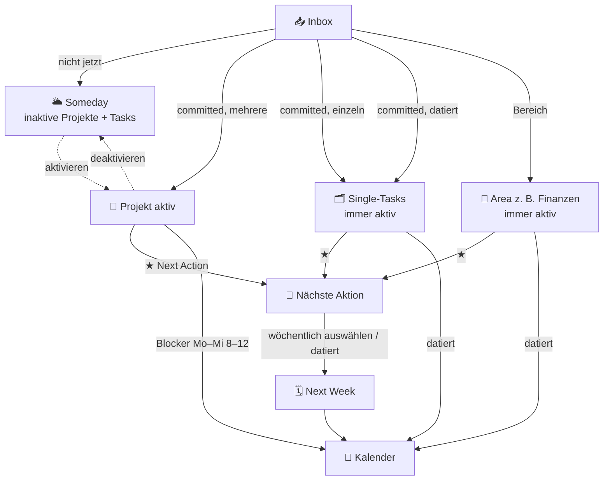

# GTD-Flow (SelfManaged)

Dieser Task-Manager bildet einen GTD-ähnlichen Workflow ab. Alles kommt über die
**Inbox** rein und wird beim Triagieren in die passende Bahn gelenkt.

## Ablauf

1. **Inbox** – Sammelstelle für alles Neue.
2. **Triagieren** (check):
   - *relevant, aber noch nicht jetzt* → **Someday** (inaktive Projekte + geparkte Tasks).
   - *committed + mehrere Schritte* → **Projekt** (aktiv).
   - *committed + Einzelaufgabe ohne Datum* → **Single-Tasks** (immer aktiv).
   - *committed + mit Datum* → **Single-Tasks** mit Fälligkeit → erscheint direkt im **Kalender**.
   - *gehört zu einem Bereich* → **Area** (wiederkehrend, z. B. „Finanzen", immer aktiv).
3. **Nächste Aktion** (★): alle markierten offenen Aufgaben aus **aktiven Projekten,
   Areas und Single-Tasks**.
4. **Next Week**: aus der Nächste-Aktion-Liste wird wöchentlich ausgewählt (manueller
   Marker). Zusätzlich tauchen **datierte Aufgaben automatisch** auf, sobald ihre Woche
   erreicht ist – parallel im Kalender.
5. **Kalender**: aktive Projekte erhalten wiederkehrende **Blocker** (z. B. Mo–Mi 8–12),
   in denen die aktuelle Next-Action des Projekts angezeigt wird. Datierte Tasks
   (Single-Tasks/Areas) erscheinen am Fälligkeitstag.
6. **Someday**: inaktive Projekte und geparkte Aufgaben. Projekte lassen sich jederzeit
   aktiv ↔ Someday schalten.

## Diagramm



## ASCII-Fallback

```
                         ┌─────────┐
                neu  →   │  INBOX  │  (alles kommt hier rein)
                         └────┬────┘
                              │ check
     ┌──────────┬────────────┼─────────────┬───────────────┐
     ▼          ▼            ▼             ▼               ▼
 nicht jetzt  committed   committed     committed       gehört zu
 relevant     + mehrere   + einzeln     + datiert       Bereich
     │         Tasks      (ohne Datum)      │               │
     ▼          ▼            ▼              ▼               ▼
 ┌─────────┐ ┌─────────┐ ┌─────────────┐  │          ┌─────────────┐
 │ SOMEDAY │ │ PROJEKT │ │ SINGLE-TASKS│◄─┘          │   AREA      │ (wiederkehrend,
 │(inaktiv)│ │ (aktiv) │ │ (immer aktiv)│             │ z.B.Finanzen│  immer aktiv)
 └─────────┘ └────┬────┘ └──┬────────┬──┘             └──┬───────┬──┘
                  │         │ ★      │ datiert            │ ★     │ datiert
                  │ ★(NA)   │        ▼                    │       ▼
                  │         │     ┌──────────┐            │   ┌──────────┐
                  ▼         ▼     │ KALENDER │◄───────────┼───┤ KALENDER │
            ┌───────────────────┐└──────────┘            ▼   └──────────┘
            │   NÄCHSTE AKTION   │◄──────────────────────┘
            │ (alle ★ aus aktiven Projekten + Areas + Single-Tasks)
            └─────────┬─────────┘
                      │ wöchentlich auswählen (thisWeek)
                      ▼
                ┌───────────┐
                │ NEXT WEEK │◄── datierte Tasks automatisch, sobald ihre Woche da ist
                └───────────┘
   Aktive Projekte → Kalender-Blocker (Mo–Mi 8–12 …) mit aktueller Next-Action.
   Inaktive Projekte → SOMEDAY.   Datierte Tasks (Single-Tasks/Areas) → direkt im KALENDER
   und in NEXT WEEK, sobald die Woche erreicht ist.
```

## Bedienung (Kurz)

- **Menüs** per Drag & Drop umsortieren (Reihenfolge wird gespeichert).
- **Projekt aktiv/Someday**: Schalter im Projekt-Kopf. **Anpinnen** (📌) floatet ein
  aktives Projekt nach oben.
- **Area** anlegen: 🔁-Button im Projekte-Panel.
- **Next Action**: Stern (★) an der Aufgabe.
- **Next Week**: Aufgabe als „diese Woche" markieren (oder Fälligkeit in den nächsten 7
  Tagen setzen).
- **Blocker**: in der Wochenansicht über „🧱 Blocker" – Projekt + Wochentage + Uhrzeit.
